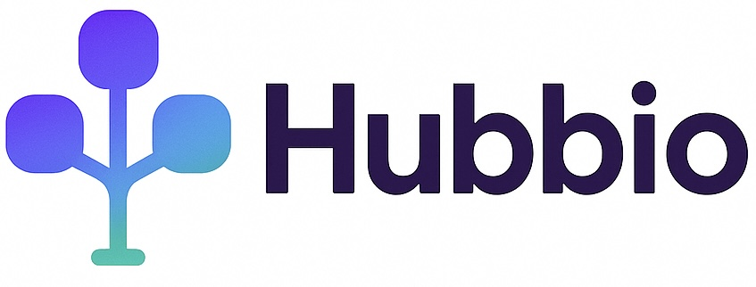

<center>
  
</center>

# Hubbio - Link smart. Live simpler

Welcome to Hubbio, the hub of bio links.

## Table of Contents

- [Summary](#summary)
- [Scope Decisions](#scope-decisions)
- [Setup and Run](#setup-and-run)
- [Available Commands](#available-commands)
- [Running Tests](#tests)

## Summary

What this platform provides:

- A login page for user authentication
- Link management: add, edit, remove, activate, and reorder links for your landing page
- Profile management: edit your username, description, and theme colors to personalize your landing page
- A public and personalized landing page with your links, theme, and personal information

## Scope Decisions

One of my decisions was to use JSON-server as an REST api emulator. Note that,in the api calls we force a delay just to make it more realistic about a async request since the json-serve response is immediate. But this brought me to a problem, the update in json-server can only edit the entire property, so different pages uses the same update method wich copies all the previous properties and update only the necessary.

For the tech stack, I chose Material UI, react-hook-form, zod, and Tailwind to speed up development. I'm familiar with MUI, and it provides beautiful components that saved time on component creation. It also integrates well with react-hook-form, which I selected for being a lightweight library, especially since we have three forms to manage (login, profile, and links).

For authentication, I chose the next-auth library, which is widely used in the NextJS community and has a beta version (AuthJS) that can be used in other frameworks. It handles the entire session management and allows easy integration with various OAuth providers like Google and GitHub. In this project, I implemented the credentials provider to work with our custom API.

For drag and drop functionality, I chose @hello-pangea/dnd to save time on styling. It's a fork of react-beautiful-dnd, which was previously supported by Atlassian but is now discontinued. It implements smooth drag and drop functionality specialized for lists, which was perfect for our use case.

Last but not least, I chose NextJS as the framework for several reasons:
- It's now the recommended framework by the ReactJS team 
- For a landing page, we need SEO, which NextJS was built for
- It's the technology I'm currently using in new projects and learning daily

## Setup and Run

1. Clone the repository

2. Access the directory:

```bash
cd link-hub
```

3. Install the dependencies:

```bash
# if using npm
npm install
```
```bash
# if using yarn
yarn
```

4. Configure the env file

The .env file was committed to help run the project easily. In a production environment, you would need to follow the .env.example file.

5. Run the project

```bash
# Starts both the project and json-server db simultaneously in the same terminal using concurrently
yarn dev:all
```

## Available Commands

- <code class="highlighter-rouge">dev</code>: Starts the development mode
- <code class="highlighter-rouge">dev:db</code>: Starts the json-server db on port 3001
- <code class="highlighter-rouge">build</code>: Compiles the project for production, generating an optimized version
- <code class="highlighter-rouge">start</code>: Starts the production build
- <code class="highlighter-rouge">lint</code>: Runs eslint for better code structure

## Tests

```bash
# if using npm
npm test

# if using yarn
yarn test
```
